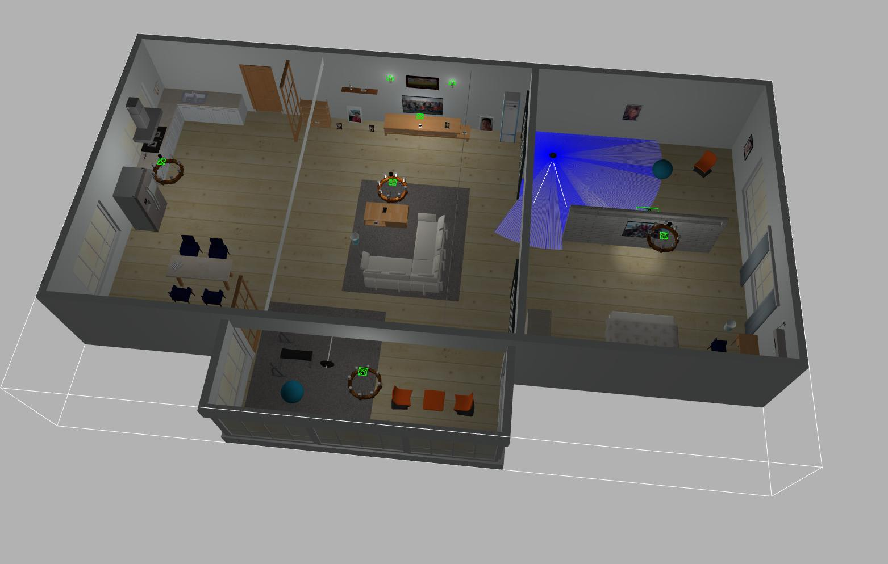
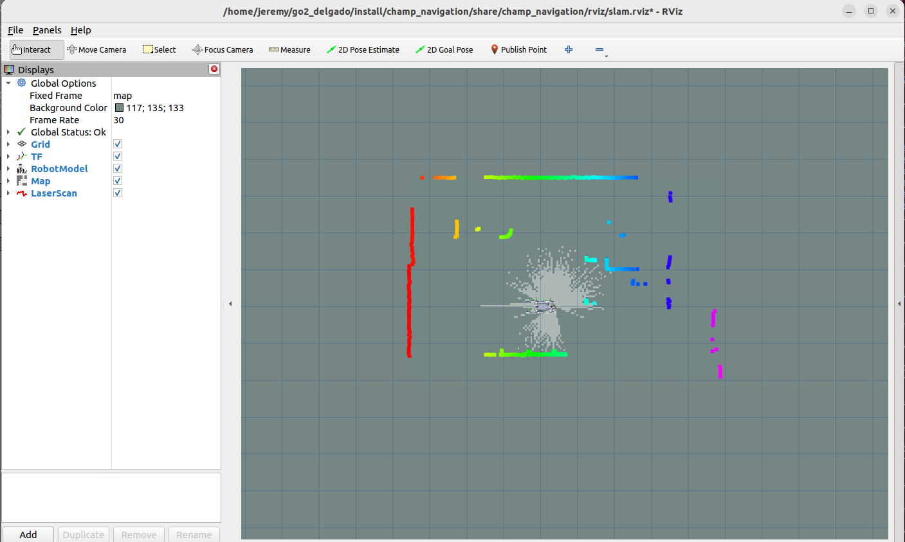
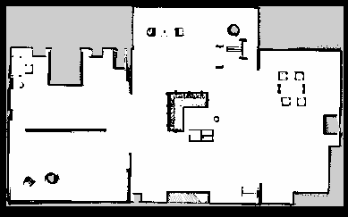
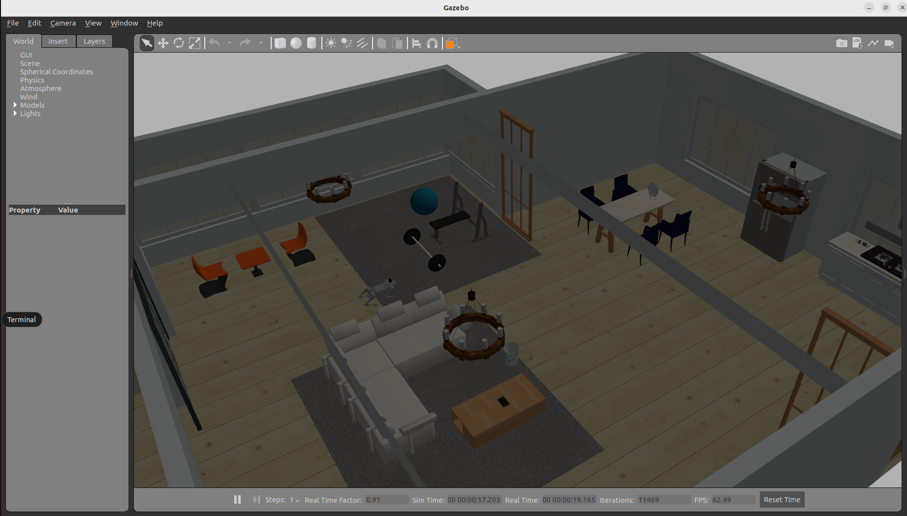
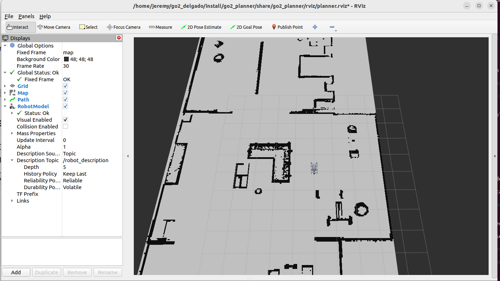
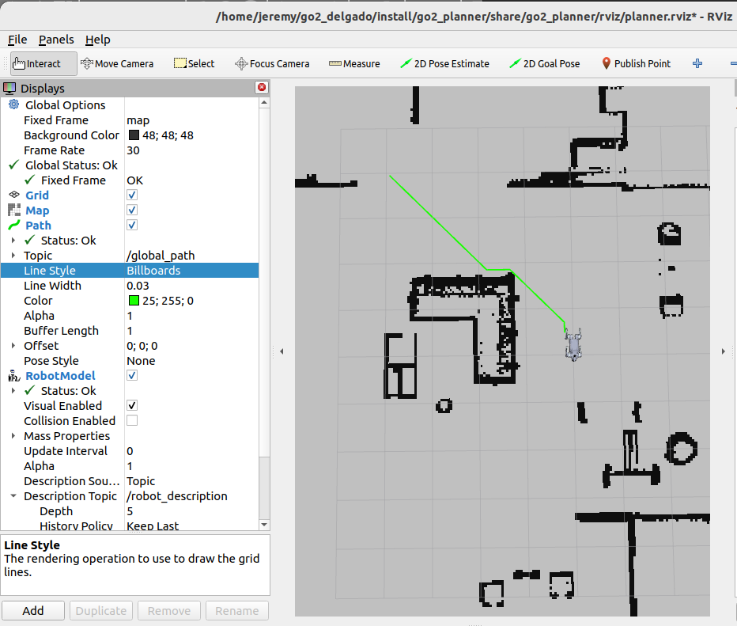
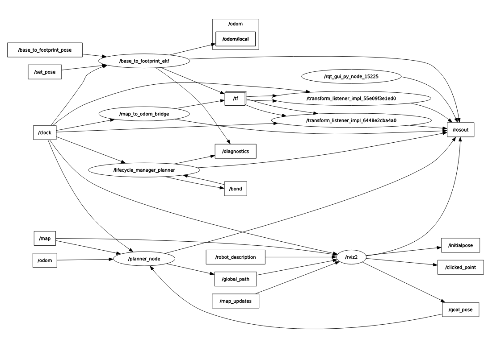

# Unitree Go2: SLAM y Planificador global de trayectorias (Dijkstra)

- **Planificador globar de trayectoria:** Dijkstra
- **Repositorio de referencia:** [https://github.com/widegonz/unitree-go2-ros2](https://github.com/widegonz/unitree-go2-ros2)
- **Mapa:** Small_house


# 1. Dependencias para ROS

```bash
sudo apt install ros-humble-gazebo-ros2-control
sudo apt install ros-humble-xacro
sudo apt install ros-humble-robot-localization
sudo apt install ros-humble-ros2-controllers
sudo apt install ros-humble-ros2-control
sudo apt install ros-humble-velodyne
sudo apt install ros-humble-velodyne-gazebo-plugins
sudo apt-get install ros-humble-velodyne-description
sudo apt install -y python3-rosdep
rosdep update
```

# 2. Guía de Instalación y Compilación
## 2.0 Clonar el repositorio:
```bash
git clone https://github.com/JeremyD111/go2_delgado
```

## 2.1 Compilación de los paquetes del proyecto
```bash
cd ~/go2_delgado
colcon build --packages-select go2_description go2_config go2_planner
source install/setup.bash
```


# 3. Mapeo del entorno (SLAM)
## 3.0 Abrir el mapa

```bash
cd ~/go2_delgado
ros2 launch go2_config gazebo_velodyne.launch.py world:=small_house
```

## 3.1 Ejecutar SLAM_Toolbox Package

```bash
cd ~/go2_delgado
ros2 launch go2_config slam.launch.py use_sim_time:=true
```

- Se abrirá Rviz tal como se muestra a continuación:


## 3.2 Nodo de teleoperacion

```bash
cd ~/go2_delgado
ros2 run teleop_twist_keyboard teleop_twist_keyboard
```

## 3.3 Mapeo 
Con ayuda del teclado empezaremos a mover el robot para mapear toda la zona del mapa small_house.

<div align="center">
  <video src="https://github.com/user-attachments/assets/d6383d34-b497-40fe-b45e-badf5860b23f" width="600px" controls></video>
  <p><i>Video 1: Demostración del proceso de mapeo (SLAM)</i></p>
</div>

## 3.4 Guardar el mapa
Guarda el mapa haciendo uso del siguiente comando:

```bash
ros2 run nav2_map_server map_saver_cli -f ~/map
```

## 3.5 Resultados
Se crearan dos archivos llamados:
- map.pgm
- map.yaml




# 4. Planificación global de trayectoria - Dijkstra
El algoritmo de Dijkstra es un método de búsqueda en grafos que garantiza encontrar la ruta de menor costo entre un punto de inicio y un objetivo. Funciona mediante una exploración expansiva que prioriza siempre los nodos con el menor costo acumulado. 

## 4.1 Entradas y salidas 
***Entradas (Subscribers):***
- `/map` `(nav_msgs/OccupancyGrid)`: Provee la información de la rejilla de ocupación y obstáculos del entorno.
- `/odom` `(nav_msgs/Odometry)`: Proporciona la posición y orientación actual del robot en tiempo real.
- `/goal_pose` `(geometry_msgs/PoseStamped)`: Recibe la coordenada de destino seleccionada manualmente por el usuario en RViz.

***Salidas (Publishers):***
- `/goal_pose` `(nav_msgs/Path)`: Envía la secuencia de waypoints óptima calculada por el algoritmo para ser visualizada en RViz.

## 4.2 Explicacion de algoritmo 

### 4.2.1 Función de Inicialización (`__init__`):
Esta función se encarga de configurar la infraestructura de comunicación y el estado inicial del nodo:

- ***Configuración de QoS:*** Define un perfil de Calidad de Servicio TRANSIENT_LOCAL para asegurar la recepción del mapa, incluso si fue publicado antes de iniciar el planificador.

- ***Suscripciones:*** Establece la comunicación con los tópicos del mapa, la odometría del robot y la pose objetivo.

- ***Publicadores:*** Inicializa el canal para enviar la trayectoria final calculada hacia RViz.

- ***Variables de estado:*** Declara las variables que almacenarán los metadatos del mapa (resolución, dimensiones, origen) y la ubicación en tiempo real del Unitree Go2.

```bash
def __init__(self):
        super().__init__('dijkstra_planner')
        
        # Configuración de QoS para el Mapa
        qos_profile = QoSProfile(
            reliability=ReliabilityPolicy.RELIABLE,
            durability=DurabilityPolicy.TRANSIENT_LOCAL,
            history=HistoryPolicy.KEEP_LAST,
            depth=1
        )

        # --- Suscriptores ---
        self.map_sub = self.create_subscription(OccupancyGrid, '/map', self.map_callback, qos_profile)
        self.odom_sub = self.create_subscription(Odometry, '/odom', self.odom_callback, 10)
        self.goal_sub = self.create_subscription(PoseStamped, '/goal_pose', self.goal_callback, 10)

        # --- Publicadores ---
        self.path_pub = self.create_publisher(Path, '/global_path', 10)

        # --- Variables de estado ---
        self.map_data = None
        self.map_res = 0.0
        self.map_origin = [0.0, 0.0]
        self.current_pose = None # [x, y]
        self.width = 0
        self.height = 0
```

### 4.2.2 Gestión de Datos del Mapa (`map_callback`):
Esta función procesa el mensaje de tipo OccupancyGrid para construir el espacio de búsqueda digital:

- ***Extracción de Metadatos:*** Almacena la resolución (metros/píxel) y el punto de origen del mapa, valores críticos para realizar transformaciones de coordenadas exactas.

- ***Transformación de Datos:*** Convierte el arreglo unidimensional de datos crudos en una matriz bidimensional de NumPy (H×W).

- ***Discretización:*** Facilita la identificación de obstáculos, donde el valor 0 representa celdas libres y valores superiores indican la presencia de paredes u objetos, permitiendo al algoritmo validar trayectorias.

```bash
def map_callback(self, msg):
        """ Recibe el mapa y lo convierte en una matriz de ocupación """
        self.width = msg.info.width
        self.height = msg.info.height
        self.map_res = msg.info.resolution
        self.map_origin = [msg.info.origin.position.x, msg.info.origin.position.y]
        # Convertir a matriz 2D: 0 es libre, >0 (u 100) es ocupado
        self.map_data = np.array(msg.data).reshape((self.height, self.width))
        self.get_logger().info("Mapa recibido correctamente")
```

### 4.2.3 Actualización de Posición (`odom_callback`):
- ***Extracción de Coordenadas:*** Filtra el mensaje de tipo Odometry para obtener exclusivamente la posición cartesiana (x,y) referenciada en metros.

- ***Definición del Punto de Inicio:*** Mantiene actualizada la variable current_pose, la cual es indispensable para determinar el nodo de origen (start node) al momento de iniciar la búsqueda del camino más corto.

```bash
 def odom_callback(self, msg):
        """ Actualiza la posición actual del robot """
        self.current_pose = [msg.pose.pose.position.x, msg.pose.pose.position.y]
```

### 4.2.4 Transformación de Coordenadas (`world_to_map` y `map_to_world`)
- ***world_to_map:*** Transforma coordenadas métricas del mundo real en índices discretos de la matriz del mapa (píxeles), restando el origen y dividiendo por la resolución

```bash
def world_to_map(self, x_world, y_world):
        """ Convierte coordenadas de mundo (metros) a índices de mapa (píxeles) """
        ix = int((x_world - self.map_origin[0]) / self.map_res)
        iy = int((y_world - self.map_origin[1]) / self.map_res)
        return (ix, iy)
```

- ***map_to_world:*** Realiza el proceso inverso para convertir los índices del camino encontrado en coordenadas espaciales que el robot pueda interpretar, multiplicando por la resolución y sumando el origen

```bash
def map_to_world(self, ix, iy):
        """ Convierte índices de mapa a coordenadas de mundo """
        wx = ix * self.map_res + self.map_origin[0]
        wy = iy * self.map_res + self.map_origin[1]
        return wx, wy
```

### 4.2.5 Generación de Vecinos (`get_neighbors`)
- ***8-Conectividad:*** Evalúa las celdas vecinas en todas las direcciones (arriba, abajo, lados y las cuatro diagonales), permitiendo una planificación de trayectoria más natural y fluida.

- ***Validación de Límites:*** Verifica que las coordenadas generadas se encuentren dentro de las dimensiones reales de la matriz de ocupación para evitar errores de desbordamiento de índices.

- ***Detección de Obstáculos:*** Filtra únicamente las celdas cuyo valor en map_data sea exactamente 0 (espacio libre), garantizando que la ruta no atraviese paredes.

- ***Ponderación de Costos:*** Asigna un costo diferenciado según el tipo de movimiento:
   - Costo 1.0: Para movimientos ortogonales.
   - Costo 1.41: Para movimientos diagonales, asegurando la precisión matemática de la distancia recorrida.

```bash
def get_neighbors(self, node):
        """ Retorna los vecinos válidos (8 conectividad) """
        neighbors = []
        for dx, dy in [(0,1),(0,-1),(1,0),(-1,0),(1,1),(1,-1),(-1,1),(-1,-1)]:
            nx, ny = node[0] + dx, node[1] + dy
            if 0 <= nx < self.width and 0 <= ny < self.height:
                # El valor 0 en el OccupancyGrid es 'espacio libre'
                if self.map_data[ny, nx] == 0: 
                    # Costo 1 para rectos, 1.41 para diagonales
                    cost = np.sqrt(dx**2 + dy**2)
                    neighbors.append(((nx, ny), cost))
        return neighbors
```

### 4.2.6 Algoritmo Central (`run_dijkstra`)
- ***Priorización:*** Utiliza una cola de prioridad para explorar siempre la celda con el menor costo acumulado.

- ***Optimización:*** Registra en `cost_so_far` el costo mínimo por celda, actualizándolo si encuentra una ruta más corta.

- ***Trazabilidad:*** Almacena el nodo predecesor en `came_from` para permitir la reconstrucción del camino.

- ***Finalización:*** Detiene la búsqueda al alcanzar el objetivo y genera la trayectoria mediante backtracking inverso.

```bash
def run_dijkstra(self, start, goal):
        """ Implementación pura de Dijkstra """
        open_list = []
        heapq.heappush(open_list, (0, start))
        came_from = {start: None}
        cost_so_far = {start: 0}

        while open_list:
            current_cost, current_node = heapq.heappop(open_list)

            if current_node == goal:
                break

            for neighbor, step_cost in self.get_neighbors(current_node):
                new_cost = cost_so_far[current_node] + step_cost
                if neighbor not in cost_so_far or new_cost < cost_so_far[neighbor]:
                    cost_so_far[neighbor] = new_cost
                    heapq.heappush(open_list, (new_cost, neighbor))
                    came_from[neighbor] = current_node
        
        # Reconstruir camino
        if goal not in came_from:
            return None
        
        path = []
        curr = goal
        while curr is not None:
            path.append(curr)
            curr = came_from[curr]
        return path[::-1] # Invertir para que vaya de start a goal
```

### 4.2.7 Activación del Planificador (`goal_callback`)
- ***Validación:*** Verifica la disponibilidad del mapa y la pose del robot antes de procesar cualquier solicitud.

- ***Preprocesamiento:*** Convierte las coordenadas métricas (inicio y meta) a índices de rejilla mediante `world_to_map`.

- ***Cálculo:*** Invoca la ejecución del algoritmo de Dijkstra para generar la secuencia de celdas óptima.

- ***Publicación:*** Envía el camino encontrado al tópico correspondiente para su visualización inmediata en RViz.

```bash
def goal_callback(self, msg):
        """ Se activa cuando el usuario pone un '2D Goal Pose' en RViz """
        if self.map_data is None or self.current_pose is None:
            self.get_logger().warn("Esperando mapa u odometría...")
            return

        start_grid = self.world_to_map(self.current_pose[0], self.current_pose[1])
        goal_grid = self.world_to_map(msg.pose.position.x, msg.pose.position.y)

        self.get_logger().info(f"Calculando ruta desde {start_grid} hasta {goal_grid}...")
        
        path_indices = self.run_dijkstra(start_grid, goal_grid)

        if path_indices:
            self.publish_path(path_indices)
            self.get_logger().info("¡Ruta encontrada y publicada!")
        else:
            self.get_logger().error("No se pudo encontrar una ruta válida.")
```

### 4.2.8 Publicación de Trayectoria (`publish_path`)
- ***Conversión:*** Traduce los índices de la rejilla a coordenadas métricas (x,y) mediante la función `map_to_world`.

- ***Construcción:*** Genera un mensaje `nav_msgs/Path` compuesto por una lista secuencial de poses (`PoseStamped`).

- ***Sincronización:*** Configura el encabezado del mensaje con el marco de referencia `map` y el tiempo actual del sistema.

- ***Salida:*** Publica la trayectoria procesada en el tópico `/global_path` para su renderizado en RViz.

```bash
def publish_path(self, path_indices):
        """ Convierte los índices en un mensaje nav_msgs/Path """
        path_msg = Path()
        path_msg.header.frame_id = "map"
        path_msg.header.stamp = self.get_clock().now().to_msg()

        for ix, iy in path_indices:
            pose = PoseStamped()
            wx, wy = self.map_to_world(ix, iy)
            pose.pose.position.x = wx
            pose.pose.position.y = wy
            path_msg.poses.append(pose)

        self.path_pub.publish(path_msg)
```

# 5. Guía de Ejecución de la simulacion 

Siga este orden en terminales independientes:

- **Terminal 1 (Simulación):**
Lanza Gazebo, carga los controladores del Go2 y spawnea el robot en el mapa small_house.

```bash
cd ~/go2_delgado
source install/setup.bash
ros2 launch go2_config gazebo_velodyne.launch.py world:=small_house
```



- **Terminal 2 (Planificación y RViz):**
Carga el mapa, activa los servicios de navegación y abre RViz configurado.

```bash
cd ~/go2_delgado
source install/setup.bash
ros2 launch go2_planner planner.launch.py
```


## 5.1 Generacion de trayectorias

EN el Rviz, pulse el botón "2D Goal Pose" ubicado en la parte superior y de clic en cualquier lugar del mapa para que se genere automaticamente una trayectoria.



<div align="center">
  <video src="https://github.com/user-attachments/assets/bfa73f40-68c1-40c6-a760-94608ed7b121
" width="500px" controls></video>
  <p><i>Video 2: Ejecución del algoritmo de Dijkstra </i></p>
</div>


## 5.2 Estructura del Sistema (Node Graph)
Abra una tercera terminal y ejecute:

```bash
cd ~/go2_delgado
source install/setup.bash
ros2 run rqt_graph rqt_graph
```


# 6. Descripción de Launch Files

- **gazebo_velodyne.launch.py:** Configura la física en Gazebo, los sensores LiDAR y la cinemática de CHAMP para el Unitree Go2. 

```bash
import os
import launch_ros
from ament_index_python.packages import get_package_share_directory
from launch_ros.actions import Node
from launch import LaunchDescription
from launch.actions import DeclareLaunchArgument, IncludeLaunchDescription, OpaqueFunction
from launch.launch_description_sources import PythonLaunchDescriptionSource
from launch.substitutions import LaunchConfiguration

def launch_setup(context, *args, **kwargs):
    # 1. Recuperamos el nombre del mundo y la configuración de ros_control
    world_selection = LaunchConfiguration("world").perform(context)
    
    # 2. Definimos rutas base
    config_pkg_share = launch_ros.substitutions.FindPackageShare(package="go2_config").find("go2_config")
    descr_pkg_share = launch_ros.substitutions.FindPackageShare(package="go2_description").find("go2_description")
    
    # 3. Mapa de mundos con las coordenadas que definimos previamente
    world_map = {
        "bookstore": {
            "path": os.path.join(config_pkg_share, "worlds/bookstore/bookstore.world"),
            "x": "0.0", "y": "0.0", "z": "0.3"
        },
        "factory": {
            "path": os.path.join(config_pkg_share, "worlds/factory/factory.world"),
            "x": "0.0", "y": "0.0", "z": "0.4" # Elevado por seguridad en factory
        },
        "small_house": {
            "path": os.path.join(config_pkg_share, "worlds/small_house/small_house.world"),
            "x": "1.0", "y": "2.0", "z": "0.6"
            #"0.3" # Coordenadas personalizadas
        },
        "office": {
            "path": os.path.join(config_pkg_share, "worlds/office/office.world"),
            "x": "9.0", "y": "4.0", "z": "0.3" # Coordenadas personalizadas
        },
        "default": {
            "path": os.path.join(config_pkg_share, "worlds/default.world"),
            "x": "0.0", "y": "0.0", "z": "0.3"
        },
        "playground": {
            "path": os.path.join(config_pkg_share, "worlds/playground.world"),
            "x": "0.0", "y": "0.0", "z": "0.3"
        },
        "outdoor": {
            "path": os.path.join(config_pkg_share, "worlds/outdoor.world"),
            "x": "0.0", "y": "0.0", "z": "0.3"
        }
    }

    # Selección del mundo (usa default si no encuentra el nombre)
    selected = world_map.get(world_selection, world_map["default"])

    # 4. Rutas de configuración del robot
    joints_config = os.path.join(config_pkg_share, "config/joints/joints.yaml")
    gait_config = os.path.join(config_pkg_share, "config/gait/gait.yaml")
    links_config = os.path.join(config_pkg_share, "config/links/links.yaml")
    
    # NOTA: Mantenemos tu archivo xacro específico (robot_VLP.xacro)
    default_model_path = os.path.join(descr_pkg_share, "xacro/robot_VLP.xacro")

    # 5. Configuración de Bringup (CHAMP)
    bringup_ld = IncludeLaunchDescription(
        PythonLaunchDescriptionSource(
            os.path.join(
                get_package_share_directory("champ_bringup"),
                "launch",
                "bringup.launch.py",
            )
        ),
        launch_arguments={
            "description_path": default_model_path,
            "joints_map_path": joints_config,
            "links_map_path": links_config,
            "gait_config_path": gait_config,
            "use_sim_time": LaunchConfiguration("use_sim_time"),
            "robot_name": LaunchConfiguration("robot_name"),
            "gazebo": "true",
            "lite": LaunchConfiguration("lite"),
            "rviz": LaunchConfiguration("rviz"),
            "joint_controller_topic": "joint_group_effort_controller/joint_trajectory",
            "hardware_connected": "false",
            "publish_foot_contacts": "false",
            "close_loop_odom": "true",
        }.items(),
    )

    # 6. Configuración de Gazebo (CHAMP) con coordenadas inyectadas
    gazebo_ld = IncludeLaunchDescription(
        PythonLaunchDescriptionSource(
            os.path.join(
                get_package_share_directory("champ_gazebo"),
                "launch",
                "gazebo.launch.py",
            )
        ),
        launch_arguments={
            "use_sim_time": LaunchConfiguration("use_sim_time"),
            "robot_name": LaunchConfiguration("robot_name"),
            "world": selected["path"], # Ruta automática
            "lite": LaunchConfiguration("lite"),
            # Coordenadas automáticas desde el diccionario:
            "world_init_x": selected["x"],
            "world_init_y": selected["y"],
            "world_init_z": selected["z"],
            "world_init_heading": LaunchConfiguration("world_init_heading"),
            "gui": LaunchConfiguration("gui"),
            "close_loop_odom": "true",
        }.items(),
    )

    return [bringup_ld, gazebo_ld]

def generate_launch_description():
    # Definir ruta por defecto para ros_control (necesario para el argumento)
    config_pkg_share = launch_ros.substitutions.FindPackageShare(package="go2_config").find("go2_config")
    ros_control_config = os.path.join(config_pkg_share, "/config/ros_control/ros_control.yaml")

    return LaunchDescription(
        [
            DeclareLaunchArgument("use_sim_time", default_value="true", description="Use simulation (Gazebo) clock if true"),
            DeclareLaunchArgument("rviz", default_value="false", description="Launch rviz"),
            DeclareLaunchArgument("robot_name", default_value="go2", description="Robot name"),
            DeclareLaunchArgument("lite", default_value="false", description="Lite"),
            DeclareLaunchArgument("ros_control_file", default_value=ros_control_config, description="Ros control config path"),
            DeclareLaunchArgument("gui", default_value="true", description="Use gui"),
            
            # Argumento world simplificado (acepta nombres como 'factory', 'office')
            DeclareLaunchArgument("world", default_value="default", description="World name: default, factory, office, small_house, bookstore, playground, outdoor"),
            
            # Mantenemos heading por si quieres rotar el robot manualmente al inicio
            DeclareLaunchArgument("world_init_heading", default_value="0.0"),

            # Ejecución de la lógica opaca
            OpaqueFunction(function=launch_setup)
        ]
    )
```

- **planner.launch.py:** Gestiona el ciclo de vida del mapa, la transformación estática map->odom y el nodo de planificación Dijkstra.

```bash
import os
from launch import LaunchDescription
from ament_index_python.packages import get_package_share_directory
from launch_ros.actions import Node

def generate_launch_description():
    # 1. Ruta del mapa
    map_file = os.path.expanduser('~/map.yaml')
    
    # 2. Ruta de la configuración de RViz
    pkg_share = get_package_share_directory('go2_planner')
    rviz_config_path = os.path.join(pkg_share, 'rviz', 'planner.rviz')
    map_file = os.path.join(get_package_share_directory('go2_planner'), 'maps', 'map.yaml')
    
    return LaunchDescription([
        # Nodo 1: Map Server
        Node(
            package='nav2_map_server',
            executable='map_server',
            name='map_server',
            output='screen',
            parameters=[{'use_sim_time': True}, 
                        {'yaml_filename': map_file}]
        ),

        # Nodo 2: Lifecycle Manager
        Node(
            package='nav2_lifecycle_manager',
            executable='lifecycle_manager',
            name='lifecycle_manager_planner',
            output='screen',
            parameters=[{'use_sim_time': True},
                        {'autostart': True},
                        {'node_names': ['map_server']}]
        ),

        # Nodo 3: Transformación Estática 
        # Esto conecta el mapa con el robot 
        Node(
            package='tf2_ros',
            executable='static_transform_publisher',
            name='map_to_odom_bridge',
            arguments=['0', '0', '0', '0', '0', '0', 'map', 'odom'],
            parameters=[{'use_sim_time': True}]
        ),

        # Nodo 4: Nodo Dijkstra
        Node(
            package='go2_planner',
            executable='planner_node',
            name='planner_node',
            output='screen',
            parameters=[{'use_sim_time': True}]
        ),
        
        # Nodo 5: RViz2 
        Node(
            package='rviz2',
            executable='rviz2',
            name='rviz2',
            arguments=['-d', rviz_config_path],
            parameters=[{'use_sim_time': True}],
            output='screen'
        )
    ])
```

# 7. Video de youtube
[https://www.youtube.com/watch?v=PY8p1WlFl1I ](https://www.youtube.com/watch?v=PY8p1WlFl1I )


